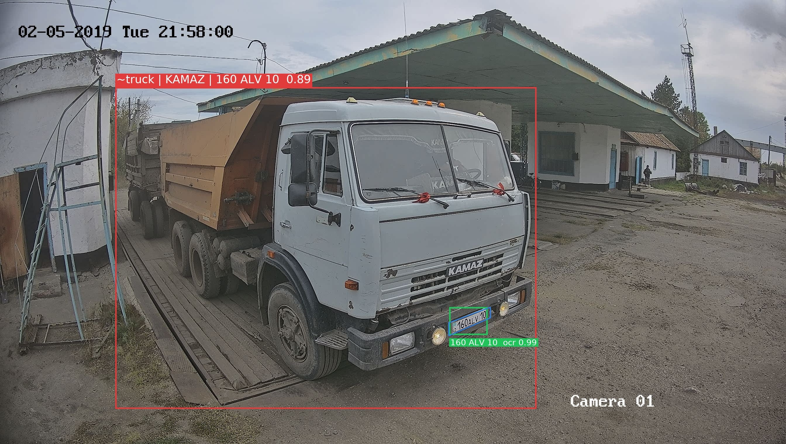
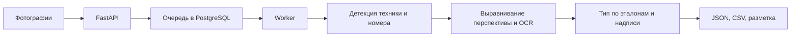

# Scanagro — распознавание техники и номеров

Сервис анализирует фотографии с камеры на сельскохозяйственном объекте:
находит технику и номерные знаки, исправляет перспективу номера, читает символы
и сохраняет результат в JSON, CSV и изображениях с разметкой.
Распознавание работает **локально на открытых моделях, без платного API**.

**Статус:** работающий бэкенд и API; пользовательский интерфейс разрабатывается.
Репозиторий содержит текущий снимок проекта Fable и проверку на 25 фотографиях.

## Для жюри: посмотреть за минуту

1. [Исходные фотографии](photos/) — данные, на которых проверяли сервис.
2. [Размеченные изображения](backend/demo_results/annotated/) и
   [фрагменты номеров до/после выравнивания](backend/demo_results/plates/).
3. [Пример полного JSON](backend/demo_results/results.json) и
   [CSV для таблиц](backend/demo_results/results.csv).
4. [Последний отчёт с метриками и ограничениями](backend/ASTRA6_REVIEW.md).
5. [Исходное задание](assignment/doc2zadanye.docx).

Пример сохранённого результата обработки:



Изображения и экспорты в `demo_results` получены в предыдущем прогоне через API
и Docker worker. Они показывают формат результата; актуальная независимая от
совпадения с самим кадром проверка галереи описана в последнем отчёте.

## Что умеет сервис

- Загружать несколько фотографий и обрабатывать их через очередь заданий.
- Находить технику и номера, поворачивать и выравнивать изображение номера.
- Определять тип техники по эталонным фотографиям с отказом при неоднозначности.
- Читать номер и надписи на машине; сохранять причины отказа и уверенность каждого этапа.
- Исправлять результаты вручную через API и обновлять разметку.
- Выгружать результаты в JSON/CSV и возвращать изображения с рамками.

## Проверенные результаты

| Проверка | Результат |
| --- | --- |
| Читаемые номера: точное совпадение | **7 из 7** |
| Частичные номера: система воздержалась от полного ответа | **8 из 8** |
| Ложное принятие номера на нечитаемых кадрах | **0 из 10** |
| Тип техники с исключением той же машины из эталонов | **21 из 24** |
| Ошибочные ответы по типу / отказы | **0 / 3** |
| Автоматические тесты бэкенда | **126 пройдено** |

Это небольшая выборка **с одной камеры**, а не гарантия точности на любых снимках.
Параметры улучшения проверялись на этих же данных. Марки определены верно лишь
на 3 из 10 размеченных кадров; модели машин и мелкие надписи часто не читаются.
Правила двухстрочных номеров остаются предварительными. Подробности, исходная
разметка, результаты до/после и команды воспроизведения — в
[отчёте](backend/ASTRA6_REVIEW.md) и [папке оценки](backend/eval/).

## Как запустить и показать вживую

Нужны Docker Desktop/Engine с Compose, Python 3.12+ и интернет для первой загрузки
образов и весов. GPU не требуется. Для демонстрации рекомендуется выделить Docker
не менее 6 ГБ RAM; это запас для API, worker и PostgreSQL, а не измеренный минимум.

```bash
git clone https://github.com/amir2008bai/scanagro.git
cd scanagro/backend
python scripts/init_config.py
docker compose up --build -d
docker compose ps
```

Первый запуск занимает время: `fetch-models` скачивает около 212 МБ зарегистрированных
артефактов, проверяет контрольные суммы и готовит галерею эталонов.

1. Откройте **http://localhost:8000/docs** — интерактивную документацию API.
2. Нажмите **Authorize**, вставьте `API_KEY` из созданного `backend/.env`.
3. Через `POST /api/v1/images` загрузите фото из `photos` с `process=true`.
4. Проверьте завершение задания через `GET /api/v1/jobs`.
5. Посмотрите объекты через `GET /api/v1/detections`, разметку через
   `GET /api/v1/images/{id}/annotated` и экспорт через `/api/v1/exports/results.json`.

Ключ нужен для локального сервиса; его не следует отправлять в репозиторий.
Это инструкция запуска на компьютере, а не ссылка на уже размещённый онлайн-сервис.
Расширенная инструкция и полный список API: [backend/README.md](backend/README.md).

## Как устроено



Бэкенд: Python, FastAPI, SQLAlchemy, PostgreSQL, Alembic.
Распознавание: RT-DETRv2, YOLOv9, OpenCV, fast-plate-ocr, PP-OCR и DINOv2.
Код моделей, веса и фотографии эталонов имеют собственные лицензии:
[описание компонентов](backend/docs/RECOGNITION.md),
[источники эталонов](backend/reference_seed/SOURCES.md).

## Навигация по проекту

| Папка | Содержимое |
| --- | --- |
| `backend/app` | API, очередь, БД и распознавание |
| `backend/tests` | Автоматические тесты |
| `backend/eval` | Разметка, оценка качества, результаты прогонов |
| `backend/reference_seed` | Начальные эталоны техники и атрибуция |
| `backend/demo_results` | Сохранённая демонстрация результатов |
| `photos`, `assignment` | Исходные фотографии и задание |

Проект дорабатывается. Секреты, рабочая БД, виртуальные окружения и кеши весов
исключены из Git. Новые изменения публикуются отдельными коммитами.
